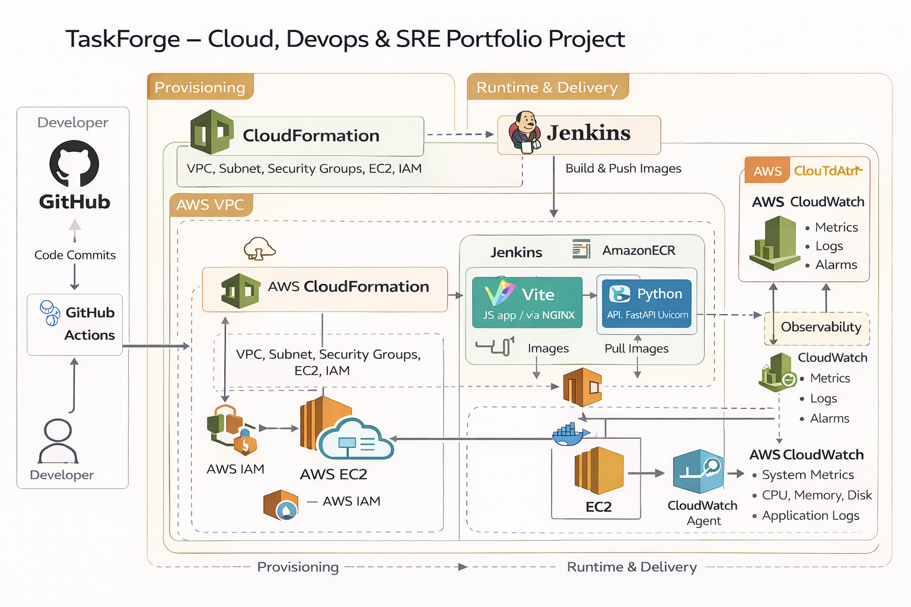
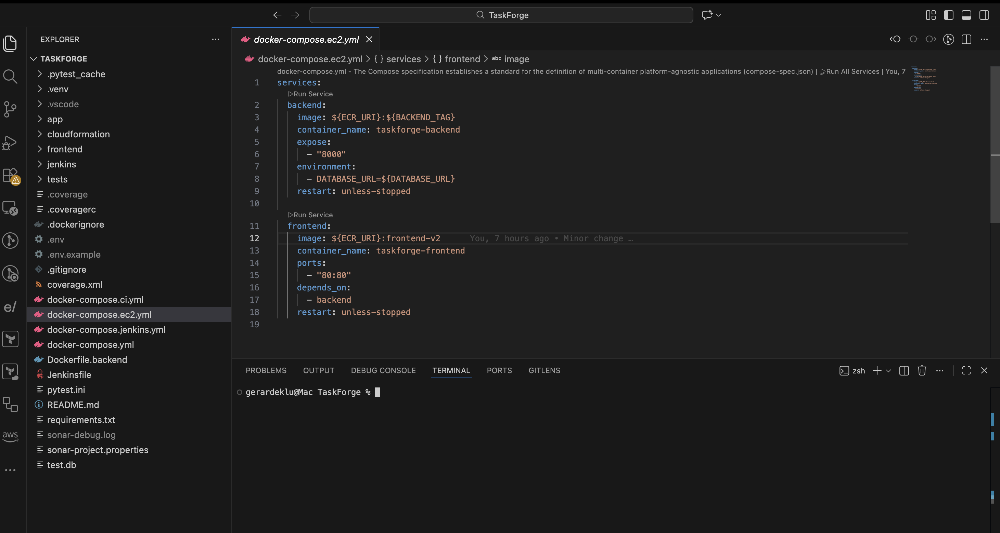
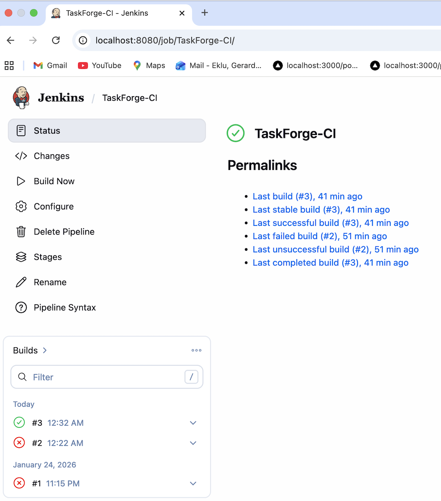
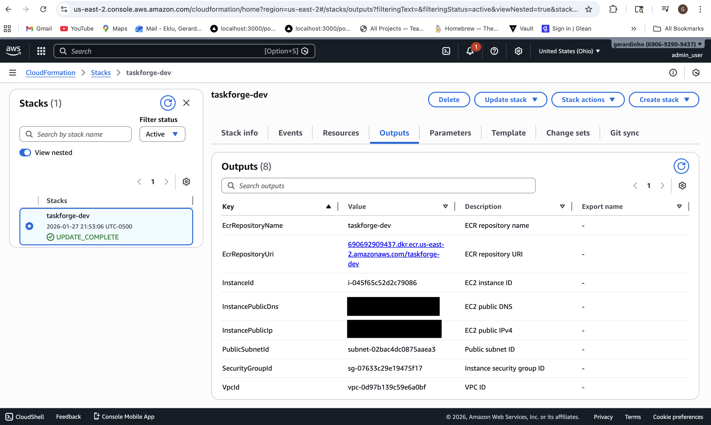
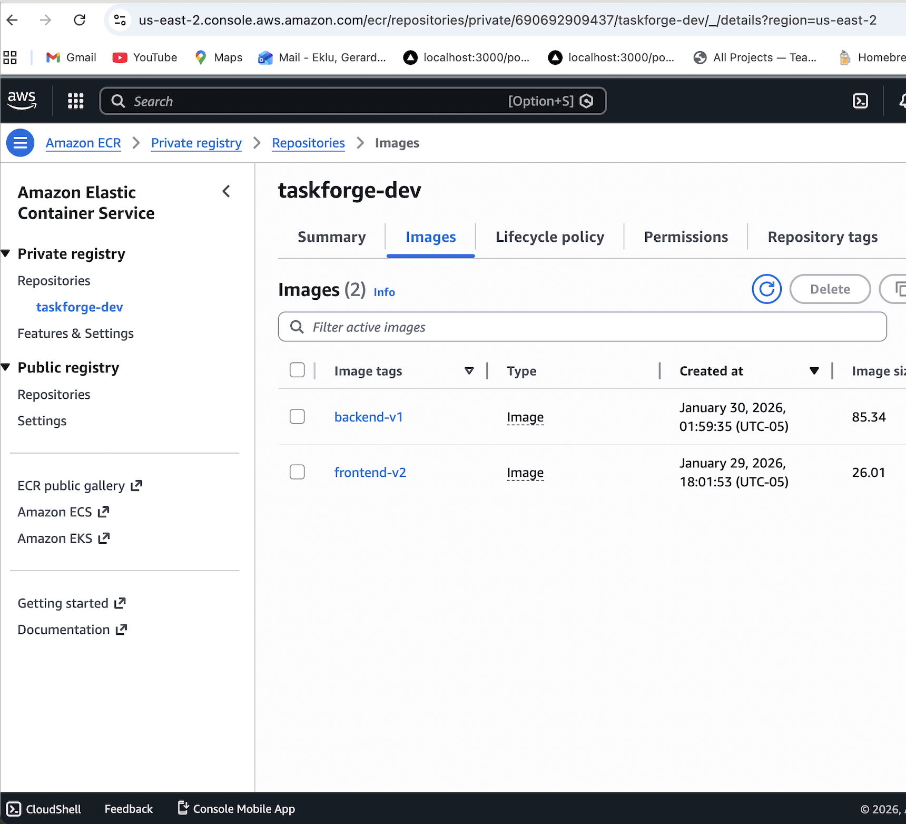
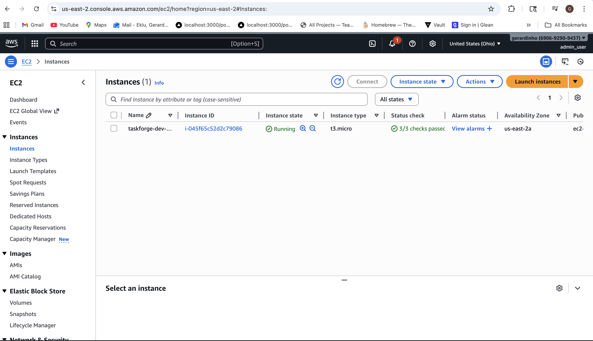
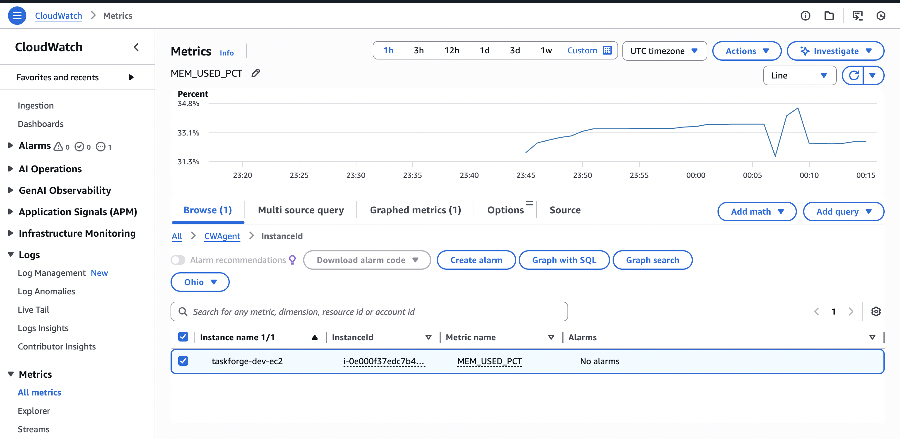
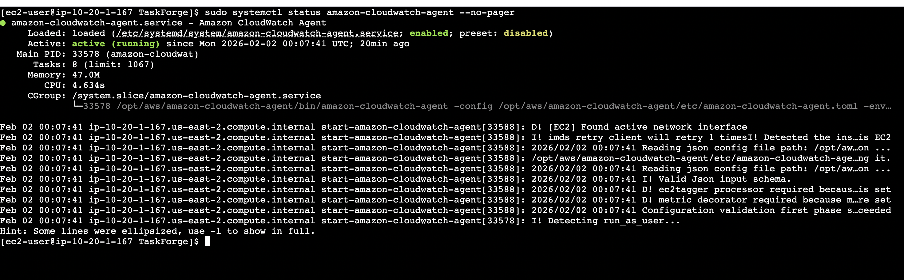

# TaskForge — AWS DevOps Platform with SRE Observability

## Overview

Full AWS DevOps platform for a containerized full-stack application — CloudFormation for infrastructure provisioning, Jenkins CI for automated Docker builds and tests, ECR for image storage, EC2 for container deployment, and CloudWatch for host-level observability. Built incrementally to reflect how production systems evolve from local development to a fully automated, observable cloud environment.

---

## High-Level Architecture

- Frontend: Static web application served by NGINX (Dockerized)
- Backend: Python API (FastAPI + Uvicorn, Dockerized)
- Infrastructure: AWS EC2 provisioned with CloudFormation
- Container Registry: Amazon ECR
- CI/CD: GitHub Actions
- Observability: AWS CloudWatch

**Architecture Overview:**

---

## Technology Stack

### Application
- Frontend: JavaScript (Vite)
- Backend: Python (FastAPI)

### Cloud & DevOps
- AWS EC2
- AWS ECR
- AWS CloudFormation
- AWS IAM
- Docker & Docker Compose
- GitHub Actions
- Jenkins

### SRE / Monitoring
- AWS CloudWatch Agent
- EC2 system metrics
- Log collection

---

## Project Phases

### Phase 1 — Application Baseline
- Established frontend and backend services
- Verified local functionality

### Phase 2 — Docker & Local Containerization
- Dockerized frontend and backend
- Multi-stage Docker builds
- Docker Compose orchestration

**Docker Compose Local:**

### Phase 3 — CI/CD Pipelines
- Jenkins pipelines
- Linting, testing, and build validation

**CI Pipeline Success:**

### Phase 4 — EC2 Deployment with ECR
- CloudFormation-provisioned EC2
- Docker images pushed to ECR
- Containers deployed via Docker Compose
- IAM roles and security groups configured

**CloudFormation Stack & ECR Images & EC2 Running Containers:**

#### Cloud Formation Stack

#### ECR Images

#### EC2 Running Container

### Phase 5 — SRE & Monitoring
- CloudWatch Agent installed on EC2
- CPU, memory, and disk metrics collected
- Log ingestion validated

**CloudWatch:**

#### CloudWatch Mem Used

#### CloudWatch Agent Running

---

## Security Practices

- No hard-coded credentials
- IAM roles attached to EC2
- Least-privilege access
- Environment variables managed securely

---

## Deployment Flow

1. Provision infrastructure via CloudFormation
2. Build Docker images
3. Push images to Amazon ECR
4. Pull images on EC2
5. Run containers using Docker Compose
6. Monitor using CloudWatch

---

## Technologies

- **AWS** — EC2, ECR, CloudFormation, IAM, CloudWatch
- **Docker** — Multi-stage builds, Docker Compose
- **Jenkins** — CI pipelines with linting, testing, and build validation
- **GitHub Actions** — Additional CI/CD workflows
- **Python / FastAPI** — Backend API
- **JavaScript / Vite** — Frontend application

---

**Author:** [Gerard Eklu](https://github.com/gerardinhoo)

